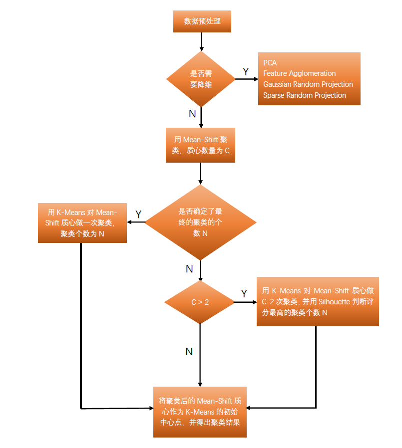
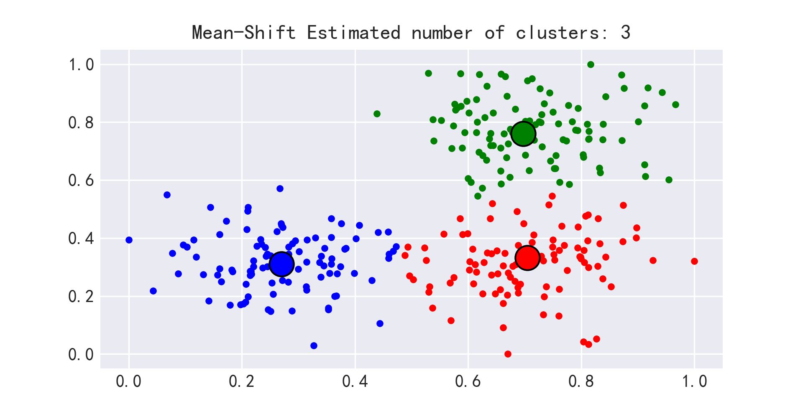
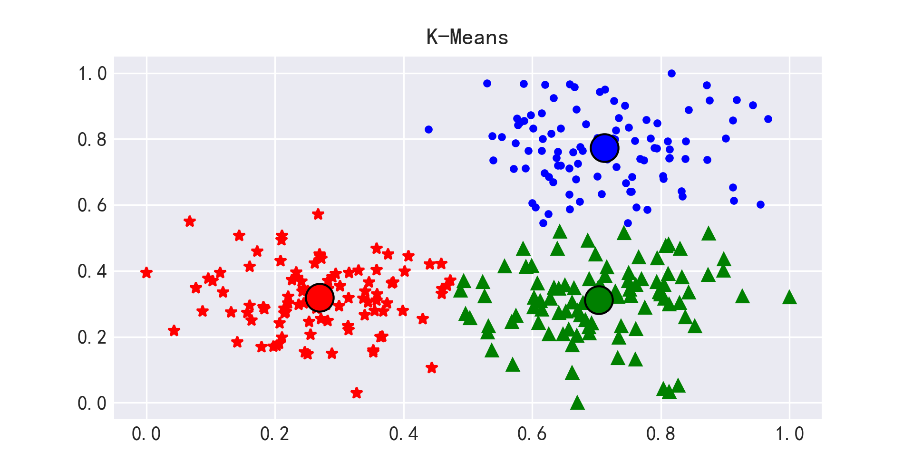
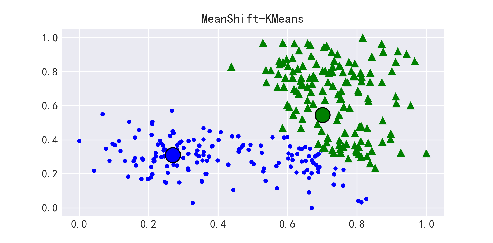

# MSK聚类算法 (MeanShift-KMeans Clustering)

一个结合了MeanShift和K-Means优点的聚类算法实现。该算法首先使用MeanShift获取初始聚类中心，然后将这些中心点作为K-Means的初始质心，从而获得更稳定和准确的聚类结果。

## 算法特点

- 无需预先指定聚类数量（自动确定最优聚类数）
- 结合了MeanShift的自适应性和K-Means的效率
- 支持多种数据预处理和降维方法
- 提供可视化支持

## 实现流程

1. 数据预处理
   - 缺失值处理
   - 数据标准化（支持MinMax和Z-score）
   - 降维处理（支持PCA等多种方法）

2. 聚类过程
   - MeanShift初步聚类获取中心点
   - 使用轮廓系数确定最优聚类数
   - K-Means精细聚类



## 主要功能

- `mean_shift()`: 纯MeanShift聚类
- `kmeans()`: 传统K-Means聚类
- `combined()`: MeanShift-KMeans组合聚类
- 支持自动降维和数据预处理
- 提供聚类结果可视化

## 环境要求

- Python 3.6+
- 核心依赖：
  ```
  pandas>=0.20.0
  numpy>=1.13.3
  scikit-learn>=0.19.1
  seaborn>=0.8.1
  matplotlib
  ```

## 使用示例

```python
from msk import MSK

# 创建聚类器实例
clusterer = MSK(
    data=your_data,
    Standardized_method=['minmax', 0, 1],
    reduced_method='PCA'
)

# 执行组合聚类
output, clusters = clusterer.combined(cluster_num=3, isPlot=True)
```

## 可视化效果

### MeanShift聚类结果


### K-Means聚类结果


### 组合聚类结果


## 优势特点

1. 自适应性强
   - 自动确定聚类数量
   - 适应不规则形状的数据分布

2. 稳定性好
   - 避免K-Means随机初始化的不稳定性
   - 降低局部最优的风险

3. 灵活性高
   - 支持多种预处理方法
   - 可自定义降维策略

## 注意事项

- 大规模数据集可能需要调整bandwidth参数
- 降维参数需要根据具体数据特点选择
- 可视化仅支持1-2维数据展示

## License

MIT License